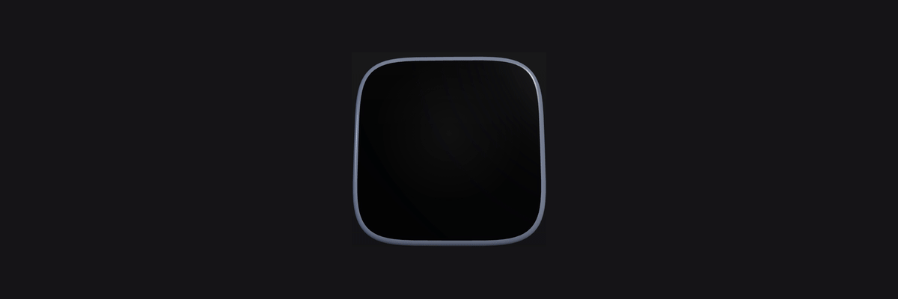

# app-icon-3d



Turn your app icon into a tactile 3D object—on the web or in a portable GLB—with no backend and no telemetry.

[Live demo](https://app-icon-3d.vercel.app) · [React package](https://www.npmjs.com/package/@danieljamestronca/app-icon-3d) · [CLI package](https://www.npmjs.com/package/@danieljamestronca/app-icon-3d-cli)

## React

```sh
npm install three @react-three/fiber @danieljamestronca/app-icon-3d
```

For a self-contained canvas:

```tsx
import { AppIcon3DCanvas } from '@danieljamestronca/app-icon-3d';

export function Icon() {
  return <AppIcon3DCanvas src="/icon.png" preset="ceramic" autoRotate interactive />;
}
```

Or place `AppIcon3D` inside an existing React Three Fiber `<Canvas>`. It accepts `src`, `preset`, `edgeColor`, `autoRotate`, `interactive`, `quality`, and `onReady`.

```tsx
<Canvas>
  <AppIcon3D src="/icon.png" preset="aluminum" edgeColor="#657089" />
</Canvas>
```

The framework-free geometry and material helpers are exported too: `createAppIconGeometry`, `createAppIconMaterials`, `createSquircleShape`, and `getPresetMaterialValues`.

## CLI

```sh
npx @danieljamestronca/app-icon-3d-cli input.png --preset ceramic --out icon.glb
```

The `app-icon-3d` command accepts local PNG, JPEG, and WebP files. It normalizes the artwork to a square, samples the non-transparent perimeter for the edge color (or accepts `--edge-color #RRGGBB`), and writes a self-contained GLB. It includes textured front/rear caps and PBR edge materials, intentionally without a camera or lighting.

## Presets

| Ceramic | Aluminum | Glass |
| --- | --- | --- |
| Glossy dielectric with a soft bevel | Brushed-metal feel with high metalness | Clear-coated, partially transmissive surface |

Try each in the [interactive demo](https://app-icon-3d.vercel.app). The original SVG sample artwork in `apps/demo/public` is MIT-licensed with this repository.

## Supported formats and limits

- Renderer: browser-reachable image URLs supported by the browser and allowed by CORS.
- Exporter: local `.png`, `.jpg`, `.jpeg`, and `.webp` inputs.
- V1 makes a polished extruded icon object; it does not infer deep, semantic 3D geometry from arbitrary artwork.
- GLB export favors a portable 1024px embedded PNG texture. Use `--quality low|medium|high` to control mesh smoothness.

## Accessibility

The renderer respects `prefers-reduced-motion`; automatic spinning stops when users request less motion. Keep a text alternative or nearby app name for meaningful artwork, and do not make a 3D preview the only way to access important information. The canvas has an accessible label in the demo; provide an equivalent label in your product context.

## Development

Requires Node 22.14+ and Corepack.

```sh
corepack pnpm install
pnpm lint && pnpm typecheck && pnpm test
pnpm build && pnpm build:demo
```

See [CONTRIBUTING.md](./CONTRIBUTING.md) for contribution and release details.

## License

[MIT](./LICENSE) © Daniel James Tronca.
